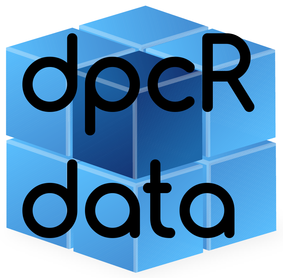

====
# Additional data sets for the analysis, visualisation and simulation of digital PCR experiments.


# Usage of the data sets

## Download

The data can be downloaded here on [github](https://github.com/michbur/dpcReport_data/archive/master.zip) as a zip-file, so that the download is as open and simple as possible. [However, this data repository can be used as any github repository](https://guides.github.com/activities/hello-world/).

## Download and read into R

All data sets can be downloaded using the following code:

```
download.file(url = "https://github.com/michbur/dpcReport_data/archive/master.zip", 
              destfile = "dpcReport_data.zip")
unzip("dpcReport_data.zip", exdir = getwd())
file.remove("dpcReport_data.zip")
# read a chosen file using dpcR package
library(dpcR)
read_dpcr(input = "dpcR_data-master/QX200.csv", format = "QX200")
```

# Software package for the data analysis

The data can be used from the web server [dpcReport](http://www.smorfland.uni.wroc.pl/shiny/dpcReport/) GUI or from the command line via the [dpcR](https://github.com/michbur/dpcR) R package.

# Sources of the data

The data were provided by researchers from independent projects. The following table gives some details on the contributors. If you wish to add a data set please contact us on github.

| Contributor | Data set | Citation |
| :-------: | :-------: | :-------: |
| Alexandra Whale | BioMark_detailed.csv | TBD |
| Alexandra Whale | BioMark_summary.xlsx | TBD |
|  | QX100.xslx | TBD |
| Michael Jahn | QX100_rawdata.zip | TBD |
| Max Kuhn | QX200.csv | TBD |
| Michał Burdukiewicz | redf.csv | TBD |

# About

This data repository is a part of [pcRuniveRsum](http://michbur.github.io/pcRuniveRsum/).
